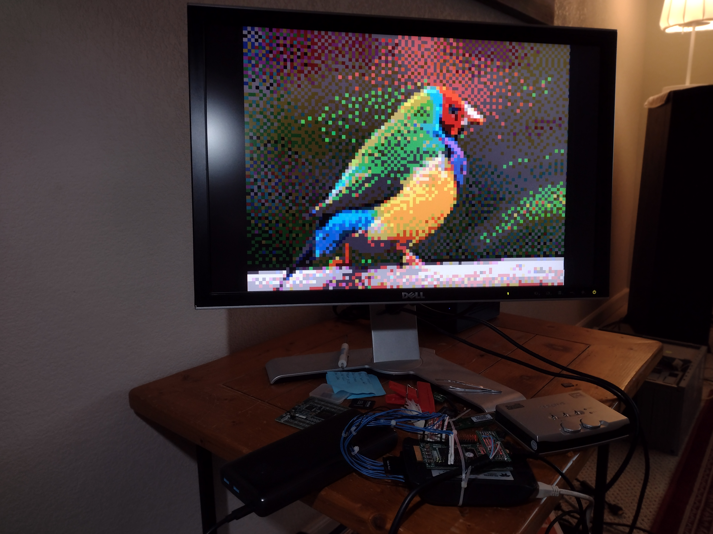

## VGA Timing generator
#### 2-bits per pixel, 800x600@60 resolution displaying a 100x75 64-color image

* vga_timing_generator.sv
* Built with Altera (Intel) Quartus,  instantiation can be found BeMicro_MAX10_top.v) starting line ~340.
* Play along at home at [Ben Eater's VGA website](https://eater.net/vga)
